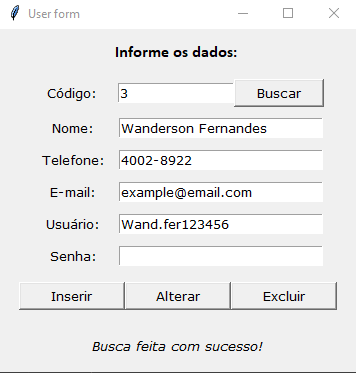
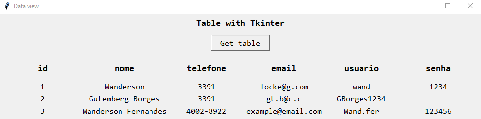

# Tkinter - Python

## User - CRUD

> A Python interface was created for insert, update, search and delete users

## Auth interface

> This works with logic to build a table using the grid layout.

### Author - Wanderson G. Fernandes

- [Instagram](https://instagram.com/locke._.wanderson?igshid=ZDc4ODBmNjlmNQ==)
- [LinkedIn](https://www.linkedin.com/in/wanderson-guedes-3138851aa)